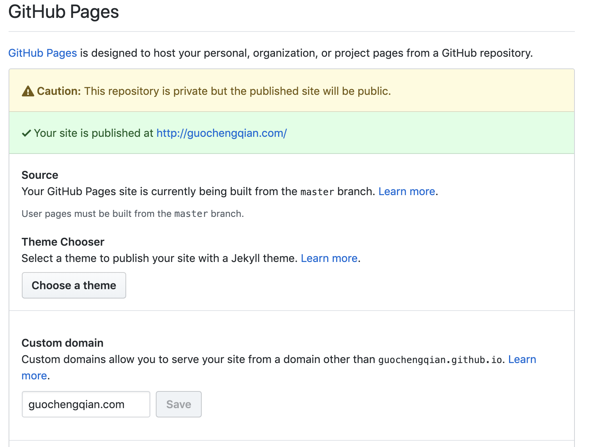

# Deep Learning Phd Wiki
My personal wiki for my Phd cadidate life in computer vision and computer graphics.
## Content
1. [Coding wiki](#coding-wiki)
    1. [Install a deep-learning-machine-environment on Ubuntu](contents/env_install.md)  
    1. [How to use Pytorch](#how-to-use-pytorch)
    1. [Pitfall in Python & Pytorch](#pitfall-in-python)
    1. [How to use Ibex](#how-to-use-ibex)  
    1. [Useful Cheatsheet](#some-useful-codes)  
1. [Personal Website](#personal-website)
# Coding Wiki


## Pitfall in Python
<!--the content inside list will be changed or not?-->
1. Mutable and inmutable data types:

    In Python, data types can be either mutable (changeable) or immutable (unchangable). 
    And while most of the data types in Python are immutable (including integers, floats, strings, Booleans, and tuples), 
    `lists and dictionaries are mutable`. That means `a global list or dictionary (mutable datatypes) can be changed even when it’s used inside of a function.`  
    If a data type is immutable, it means it can’t be updated once it’s been created. In Pytorch, all tensor operations are immutable. 
    e.g.: 
        
        initial_list = [1, 2, 3]
        def duplicate_last(a_list):
            last_element = a_list[-1]
            a_list.append(last_element)
            return a_list
        
        new_list = duplicate_last(a_list = initial_list)
        print(new_list)
        print(initial_list)
        [1, 2, 3, 3]
        [1, 2, 3, 3]
    As we can see, here the global value of initial_list was updated, even though its value was only changed inside the function!  
    Because of the mutable characteristics of list and dictionary, we usually use it to save the imortant middle results (like accuracy, metrics, args). 
    
1. 


### Some advanced operations
1. Change layers in pretrained models
`model.conv1[0] = new_model.conv1[0]`
1. detach some modules
```
for param in model.conv1.parameters():
    param.requres_grad = False
for k, param in model.named_parameters():
    print(k, param.requires_grad)
```
## How to use Ibex
### Termius
I would recomment a software called [termius](https://termius.com/) to all of you. This software keep you away from inputing account and password every time you want to login in the cluster.

You have to add host in termius. Add address, click ssh, add username and password once in termius, then you just need to click the host name then you can login into cluster(ibex). For example:
   
- address:vlogin.ibex.kaust.edu.sa  
- username: qiang  
- password: Kaustxxxx  

### Apply for resources in cluster
You can either use sbatch or srun to run your program in cluster. 

1. sbatch
 
First option is using sbatch to send your job. 
Sbatch send your job in the priority squeue and your code will contiue to run even if your connection with cluster is closed for some reason.

There is an example of sbatch file. (find the file in `modules/train_ibex.sh`):
```
#!/bin/bash --login
#SBATCH -N 1
##SBATCH --array=1  # repeat the task
#SBATCH -J rloc
#SBATCH -o log/%x.%3a.%A.out    # make sure the log folder exists
#SBATCH -e log/%x.%3a.%A.err
#SBATCH --time=5-0:00:00
#SBATCH --gpus=8            # or: --gres=gpu:v100:8
#SBATCH --gpus-per-node=8   # use gpu_wide
#SBATCH --cpus-per-gpu=6
#SBATCH --mem-per-gpu=45G
#SBATCH --mail-user=xxx@kaust.edu.sa    # send message to your email
#SBATCH --mail-type=ALL
#SBATCH -A conf-gpu-2020.11.23
#SBATCH --constraint=[ref_32T]  # use shared folder in v100s.

# activate your conda env
echo "Loading anaconda..."

module purge
module load gcc
module load cuda/10.1.105
module load anaconda3
conda activate deepgcn

echo "...Anaconda env loaded"
python -u examples/classification/train.py  --phase train --train_path /scratch/dragon/intel/lig/guocheng/data/deepgcn/modelnet40
echo "...training function Done"
```

Run `sbatch train_ibex.sh` then your job will be put in the squeue. 

See [KAUST IBEX offical doc](https://www.hpc.kaust.edu.sa/sites/default/files/files/public/Cluster_training/26_11_2018/0_Ibex_cheat_sheet_Nov_26_2018.pdf) for detailed information. 


2. srun   
srun allow you to use cluster just like in terminal on your local machine. 
srun is convenient to use however it will stop run when you loss connection to ibex. You need tmux to protect the node. When you lose connection, you can use tmux to login back into the node. 
```
tmux new -s job1 
srun --time=5-00:00:00 --cpus-per-task=4 --mem=10G --gres=gpu:1 --job-name=gsr8 --pty bash
```

3. salloc
Please do NOT use salloc, only if you need all the GPUs in the node.
```
salloc --time=5-00:00:00 --cpus-per-task=8 --mem=32G --gres=gpu:4 --job-name=sr
```

There is a [tmux cheatsheet](https://gist.github.com/MohamedAlaa/2961058) 

### Load or purge modules
- use `module list` to see your current modules
- use `module avail` to see all the modules available in cluster
- use `module purge` to unload all the modules you loaded
- use `module unload xxx` to unload a module 
- use `module load xxx` to load the module you want


###  Data Localtion 
Put your data in this folder `/ibex/scratch/$YOUR ACCOUNT$`. IO in this folder is faster than other location.

### File Transfer
Termius allows you to transfer files by GUI.
You can also transfer files by scp. 
```  
scp -r FolderPath YourAccount@YourIP:/location  # scp a folder
scp FilePath YourAccount@YourIP:/location  # scp a file
rsync -vahP FilePath qiang@10.68.74.156:location
```
You can know your ip by `ifconfig`

If you want to scp many files, you can zip it at first. It's faster.  

### Skynet IP
If you are in Bernard's Group, you can use skynet (our own cluster), ip is 10.68.106.3.  
Login in by  `ssh youraccount@10.68.106.3`


## Some useful codes
<!--
### Debug
1. tensor 2 CV IMAGE 
```
from TorchTools.DataTools.FileTools import _tensor2cvimage 
import numpy as np 
import cv2 
img_output = _tensor2cvimage(img[0], np.uint8) 
cv2.imwrite('/data/debug/img.png', img_output)  
```

2. model parameters  
model.SFE1.nn._modules['0'].weight

-->
### Linux 
1. counting  
ls -l | wc -l
2. download  
wget -r -p -np -k  
3. count storage usage  
du --max-depth=1 -h
4. show modified time  
stat -c '%y : %n' ./*  
5. watch gpu usage  
watch -n 0.1 nvidia-smi

  
### Vim
vim top of file :gg  
vim end of file: GA (remember CAPS)  
[Vim cheatsheet](https://vim.rtorr.com/)

### MarkDown
[Markdown Cheatsheet](https://github.com/adam-p/markdown-here/wiki/Markdown-Cheatsheet)

### Tmux
[Tmux Cheatsheet](https://gist.github.com/MohamedAlaa/2961058)
    
### Pycharm
[Pycharm Cheatsheet](https://www.jetbrains.com/help/pycharm/mastering-keyboard-shortcuts.html)


### jupter lab
[JupyterLab Cheatsheet](https://blog.ja-ke.tech/2019/01/20/jupyterlab-shortcuts.html)


# Personal Website
Personal website is important to an acdemic researcher.
## How to design Your Own Homepage
### Github Pages set up 
You can use github pages to host your website for free. Just follow the step, it takes you 30 min than you will enjoy your own pages.

1. Create a github account. Config your git environment. (if you are not familiar with git, please refer to [git beginner](https://product.hubspot.com/blog/git-and-github-tutorial-for-beginners).) 

2. Create a new repository(repo) in github, name rop into `username.github.io`  (username is your github account name). (You cannot use other name. This repo is different with others, it is a special repo called github pages. Refer to [how to design github pages for details](https://guides.github.com/features/pages/). It may take you 20 mins.)

3. Find a personal homepage that you like and down the source code by : 
    ```
    wget -r -p -np -k http:xxxx.com
    ```
    Please ask for the author for the approval.

4. Keep and architectrure the same but change content into yours.

5. Put all the source code into github page repo your created before. 

6. Git add, commit and push the code. 

7. Done! It's so easy. Surf your website username.github.io and enjoy!   
   More information you can looking into [github pages](https://guides.github.com/features/pages/)
   or google.  


If you want use your own domain like xxx.com instead of the free github.io, please refer to follows.
### New domain username.com Setup
We have to buy a new domain and redirect the xxx.github.io to this domain.  
1. buy a domain(you can buy from alibaba, tencent, godaddy, name.com, I buy it from www.laoxuehost.com)  
2. set up dns (please refer to details  
3. repo setting (Type your new website in custom domain in repo setting. Like the picture show.  
   
4. wait for the new domain to be become effective. (Be patient, it could be as long as 1day)  
5. Done! Surf your website username.com and enjoy   
    If you have any problem, you can looking into 
    [Github Page Redirect](https://help.github.com/en/articles/redirects-on-github-pages).  
for more detailes.

### Google index 
Let baidu google know your domain, so you can search your website by google
1. submit url  
submit url to [baidu](https://ziyuan.baidu.com/linksubmit/url), [google](https://search.google.com/search-console/welcome)

